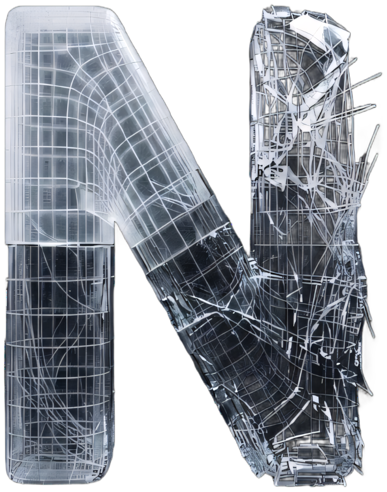
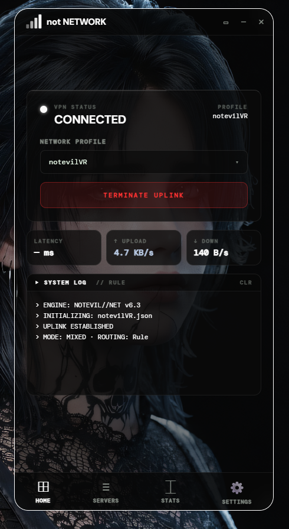
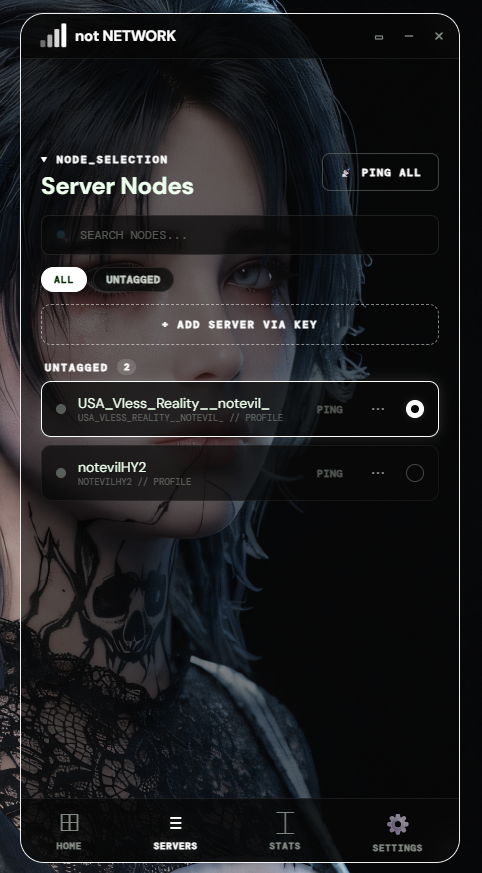
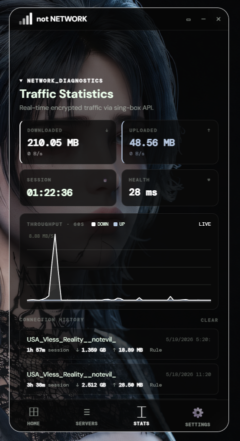
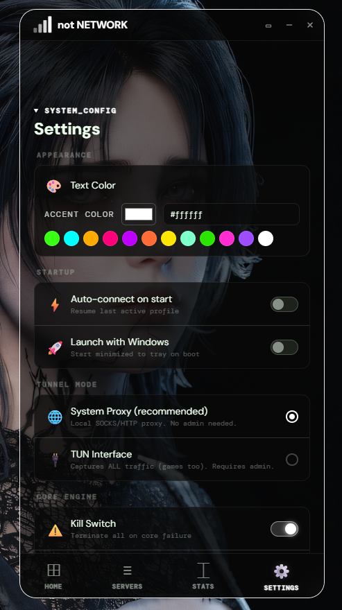

<div align="center">



# not NETWORK

**Custom VPN client for Windows**

A from-scratch VPN client built on [sing-box](https://github.com/SagerNet/sing-box) core.
Not a wrapper — a complete reimagining of what a VPN GUI should be.

`Python` `PyQt6` `sing-box` `VLESS/Reality` `Hysteria2`

---

</div>

<br/>

## Overview

not NETWORK is a native Windows VPN client designed for users who need full control over their connection. Built as a single-file Python application (~3800 lines) with a custom HTML/CSS/JS interface rendered through QWebEngine, it combines the power of sing-box's multi-protocol core with an interface that doesn't look like it was built in 2005.

Every pixel follows the **not** design language: dark glass morphism, violet accents, zero visual noise.

<br/>

## Screenshots

<div align="center">

| Home | Servers |
|:---:|:---:|
|  |  |

| Statistics | Settings |
|:---:|:---:|
|  |  |

</div>

<br/>

## Features

### Protocols
— **VLESS + Reality** — modern censorship-resistant protocol with TLS fingerprint camouflage
— **Hysteria2** — UDP-based high-speed protocol optimized for lossy networks
— Import servers via **share links** (vless://, hy2://) or manual key entry

### Tunnel Modes
— **System Proxy** — local SOCKS5/HTTP proxy, no admin required, lightweight
— **TUN Interface** — kernel-level capture of all system traffic including games, requires admin
— Automatic DNS routing to prevent proxy loops on VPN server IPs

### Network
— **Kill Switch** — terminate all connections on core failure, prevents leaks
— **Auto-connect on start** — resume last active profile automatically
— **Launch with Windows** — start minimized to system tray on boot
— Health check system with configurable intervals and failure alerts

### Server Management
— Server node list with **ping testing** (individual and bulk)
— **Tag system** — organize servers by region, speed, or purpose
— Add servers via share key or clipboard paste
— Connection history with session duration, data transferred, and timestamps

### Monitoring
— **Real-time throughput graph** — 60-second rolling window, download + upload
— Live download/upload speed, total data transferred
— Session timer and connection health indicator (latency in ms)
— Scrollable system log with error highlighting

### Interface
— Full **HTML/CSS/JS** GUI rendered through QWebEngine + QWebChannel bridge
— Customizable **accent color** — pick any color from the palette
— Four-tab layout: Home, Servers, Stats, Settings
— System tray with quick connect/disconnect
— Single instance enforcement — prevents duplicate windows

<br/>

## Architecture

```
┌──────────────────────────────────────────────────┐
│  not NETWORK                                      │
│                                                    │
│  ┌────────────┐    QWebChannel    ┌─────────────┐ │
│  │  Frontend   │ ◄──────────────► │   Backend    │ │
│  │  HTML/CSS/JS│                  │   Python     │ │
│  │  (WebView)  │                  │   PyQt6      │ │
│  └────────────┘                  └──────┬──────┘ │
│                                         │        │
│                              ┌──────────▼───────┐│
│                              │   sing-box core   ││
│                              │   (subprocess)    ││
│                              └──────────────────┘│
│                                                    │
│  System Proxy (SOCKS/HTTP)  ◄─►  TUN Interface    │
│  Port 12334                      notevil-tun       │
└──────────────────────────────────────────────────┘
```

<br/>

## Tech Stack

| Component | Technology |
|:---|:---|
| **Language** | Python 3.11+ |
| **GUI Framework** | PyQt6 + QWebEngine |
| **Interface** | HTML / CSS / JavaScript via QWebChannel |
| **VPN Core** | sing-box (VLESS, Hysteria2, mixed proxy, TUN) |
| **System** | Windows API (ctypes), winreg, psutil |
| **Packaging** | PyInstaller → single .exe |

<br/>

## Design

not NETWORK follows the **not** design system:

```
◇ Dark glass morphism     — translucent panels on pitch-black
◇ Violet accent (#8083ff) — the signature color across all states
◇ Monospace typography     — terminal-inspired, precise, no serif
◇ Minimal chrome          — content fills the window, no wasted space
◇ GPU compositing         — smooth transitions via QWebEngine renderer
```

<br/>

---

<div align="center">

**not NETWORK** is part of the [not ecosystem](https://github.com/notevil076) — a collection of tools for Windows that replace what's broken with something that isn't.

[](https://github.com/notevil076)
[](https://t.me/notevil076)

</div>
